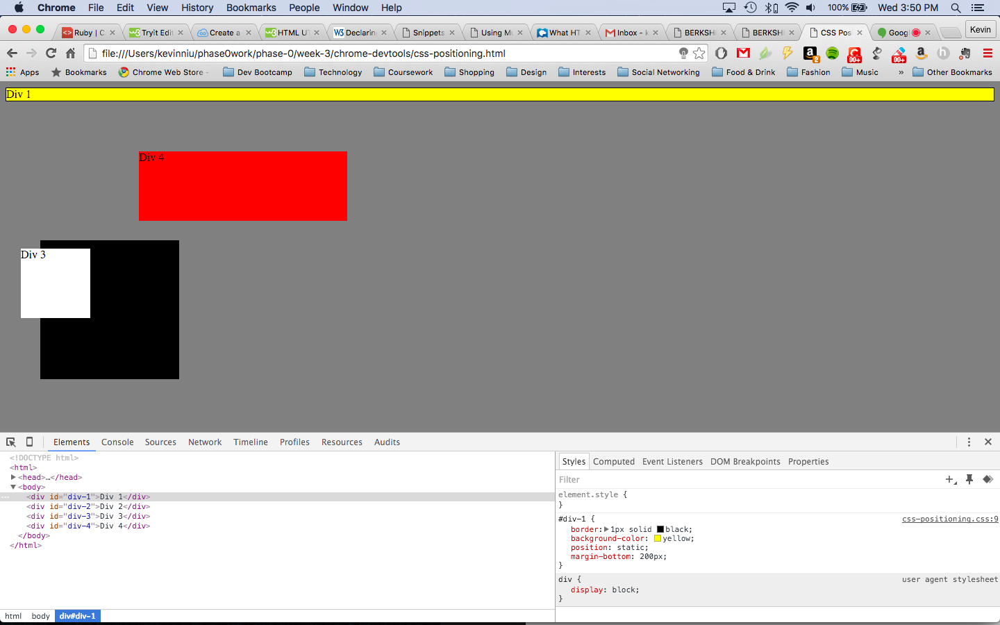
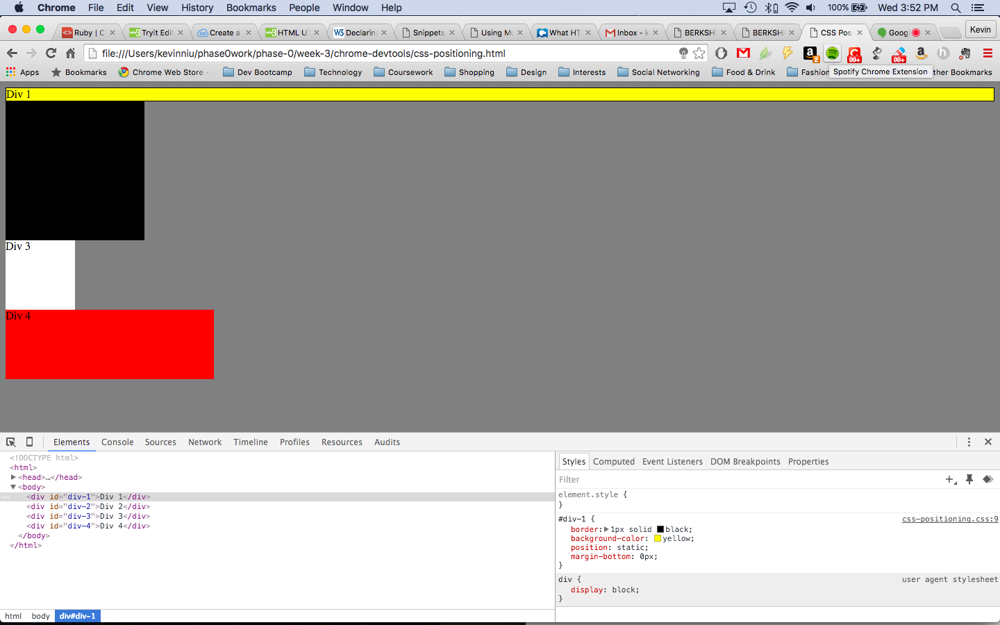
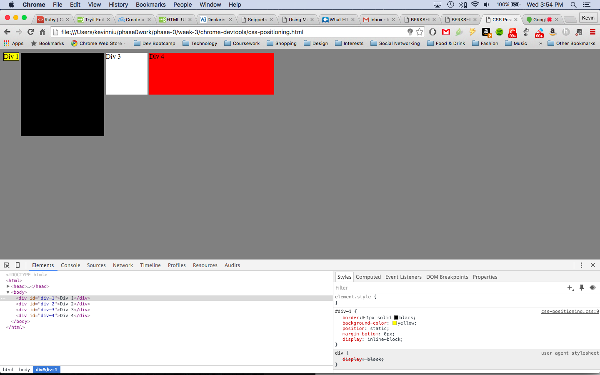
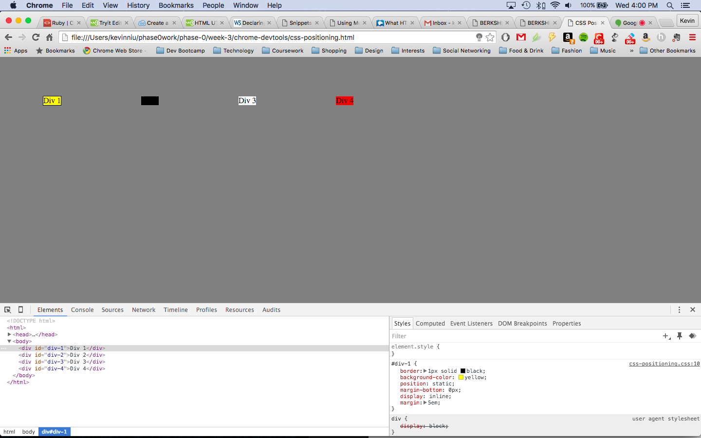
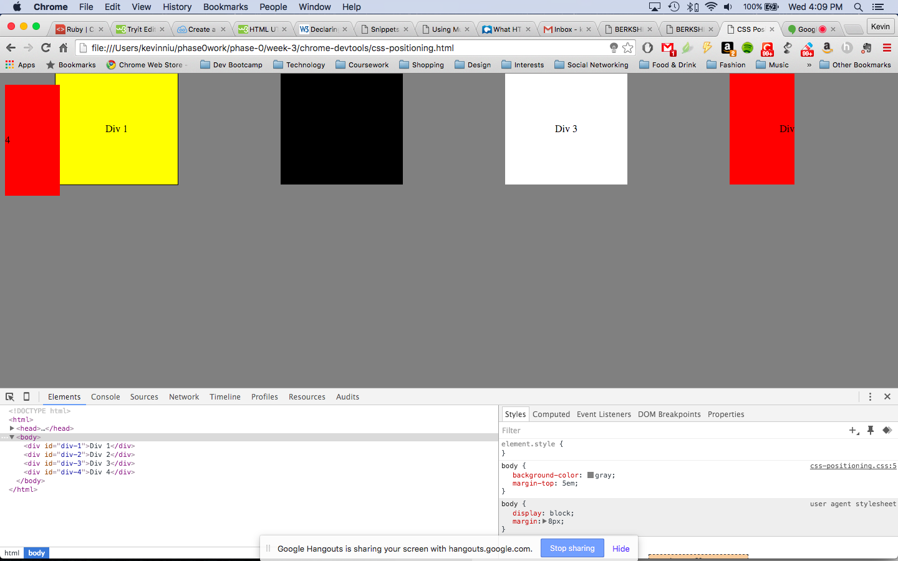
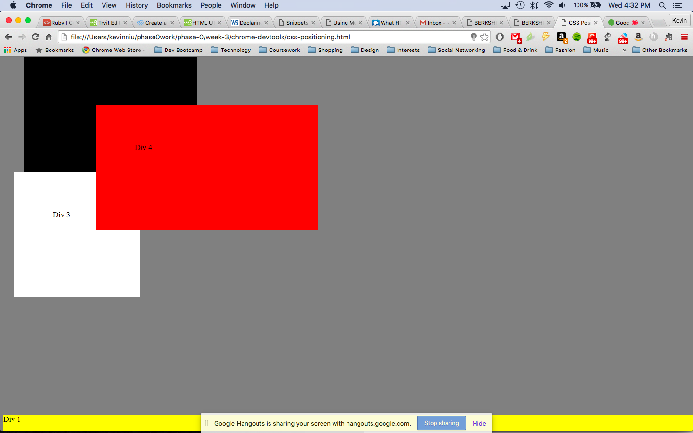
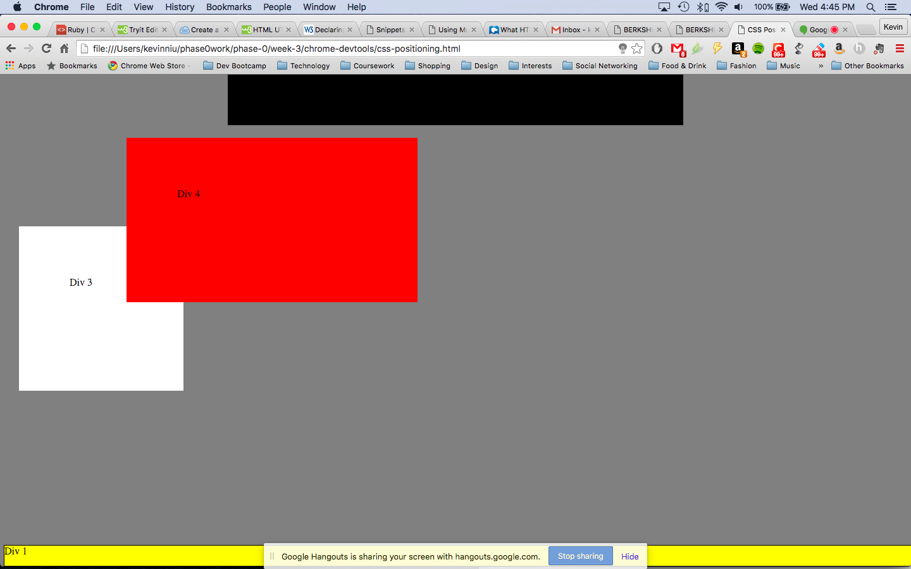
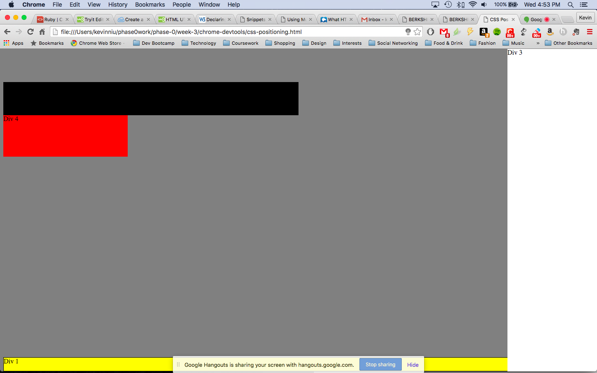
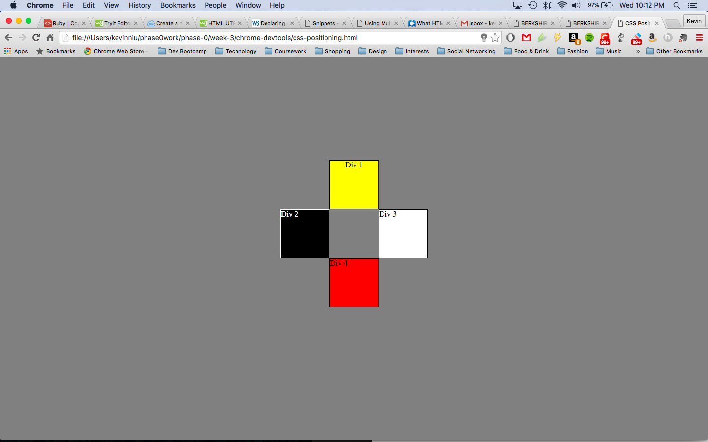

How can you use Chrome's DevTools inspector to help you format or position elements?
The DevTools allow you to see everything in one DOM tree and allows you to insepct and edit DOM elements.

How can you resize elements on the DOM using CSS?
Elements can be resized by entering in the height and width which can be pixel based or percentage based.

What are the differences between absolute, fixed, static, and relative positioning? Which did you find easiest to use? Which was most difficult?
Static is the default type of positioning, these elements will stack in a standard one-after another order. Relative positioning moves an element from the position it would be by normal-flow, shifting to the top, right, bottom, or left of where it would have been placed. Absolute positioning positions the element in relation to its parent element, it is taken out of normal flow so it does not affect the position of any surrounding elements. Fixed positioning positions the element relative to the browser window as opposed to static default.

I thought relative and static were probably the easiest to visualize. Absolute was difficult to understand in this exercise since the parent was the entire body.

What are the differences between margin, border, and padding?
Padding is the space between the content and the border. Margin is the space between the border and the next element.

What was your impression of this challenge overall? (love, hate, and why?)
The challenge definitely helped me see what's possible with CSS and how much formatting and positioning you can control just from CSS. It was frustrating at times trying to figure out what all the positioning elements did, especially when it didin't look like your revised code changed anything at all. So there was a lot of researching and googling involved.