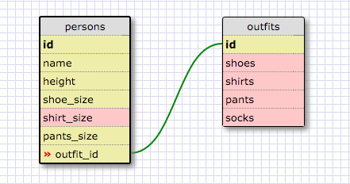

1. Select all data for all states
sqlite> SELECT *
   ...> FROM states;

2. Select all data for all regions.
sqlite> SELECT *
   ...> FROM regions
   ...> ;

3. Select the state_name and population for all states.
sqlite> SELECT state_name, population
   ...> FROM states
   ...> ;

4. Select the state_name and population for all states ordered by population. The state with higest population should be at the top.
sqlite> SELECT state_name, population
   ...> FROM states
   ...> ORDER BY population DESC;

5. Select the state_name for the states in region 7.
sqlite> SELECT state_name
   ...> FROM states
   ...> WHERE region_id=7;

6. Select the state_name and population_density for states with a population density over 50 ordered from least to most dense.
sqlite> SELECT state_name, population_density
   ...> FROM states
   ...> WHERE population_density>=50
   ...> ORDER BY population_density ASC;

7. Select the state_name for states with a population between 1 million and 1.5 million people.
sqlite> SELECT state_name
   ...> FROM states
   ...> WHERE population>1000000
   ...> AND population<1500000;

8. Select the state_name and region_id for states ordered by region in ascending order.
sqlite> SELECT state_name, region_id
   ...> FROM states
   ...> ORDER BY region_id ASC;

9. Select the region_name for the regions with "Central" in the name.
sqlite> SELECT region_name
   ...> FROM regions
   ...> WHERE region_name LIKE '%Central%';

10. Select the region_name and the state_name for all states and regions in ascending order by region_id. Refer to the region by name. (This will involve joining the tables).
sqlite> SELECT regions.region_name, states.state_name
   ...> FROM states
   ...> LEFT JOIN regions
   ...> ON states.region_id=regions.id
   ...> ORDER BY states.region_id ASC;

persons and outfits SCHEMA DESIGN

REFLECTION
What are databases for?
Databases are for storing information/data in a structured way that makes it easy to search for and access.
What is a one-to-many relationship?
A one-to-many relationship means each row in the related to table can be related to many rows in the relating table allowing used information to be save only once in a table and referenced many times in all other tables.
What is a primary key? What is a foreign key? How can you determine which is which?
A primary key is a key in a relational database that is unique for each record.
A foreign key is a field or collection of fields in one table that uniquely identifies a row of another table.
How can you select information out of a SQL database? What are some general guidelines for that?
You can selection information out of a SQL database by using certain keywords to tailor the infomration you want returned to you. These include commands like SELECT, FROM, WHERE, ORDER BY, etc. followed usually by column names, table names, and various conditional statements.